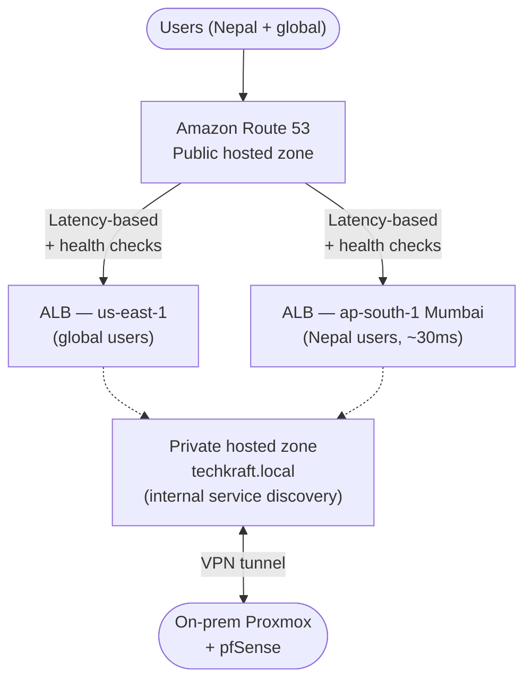

# Part 5: Redundant DNS Architecture for TechKraft

## Problem

The single Unbound DNS server on EC2 is a critical single point of failure. If it goes down, all DNS resolution stops.

---

## Solution

Replace it with **Amazon Route 53** (a managed, globally redundant DNS service with a 100% SLA) and add a second region in **Mumbai (ap-south-1)** for low-latency access from Nepal.

---

## How It Works

**Public DNS.** 
Route 53 uses latency-based routing to send each user to their closest region. Nepal users go to Mumbai (~30ms); everyone else goes to us-east-1. Health checks run every 10 seconds against the ALBs — if one region fails 3 times in a row, traffic automatically fails over to the other region (~30s detection).

**Internal DNS.** 
A private hosted zone (`techkraft.local`) handles service discovery inside the VPC — instances resolve things like `db.techkraft.local` to the RDS endpoint.

**Hybrid DNS.** 
A Route 53 Resolver endpoint bridges cloud and on-prem. The on-prem pfSense/Unbound can resolve cloud names, and cloud instances can resolve on-prem names — all over the existing VPN.

---

## Why Mumbai for Nepal

| Region | Distance from Kathmandu | RTT |
|---|---|---|
| ap-south-1 (Mumbai) | ~1,500 km | 25–35 ms |
| ap-southeast-1 (Singapore) | ~4,000 km | 60–80 ms |
| us-east-1 (Virginia) | ~12,000 km | 200–250 ms |

Mumbai is the obvious choice.

---

## Cost (Monthly)

| Item | Cost |
|---|---|
| Route 53 hosted zones (public + private) | $1 |
| DNS queries (~1M/month) | ~$0.40 |
| Health checks (4 × HTTPS) | $2–$8 |
| Resolver endpoints (optional, for hybrid DNS) | ~$365 |

**Minimum viable:** ~$10/month (skip Resolver endpoints; use VPN + Unbound forwarding).
**Full hybrid setup:** ~$375/month.

Start minimal. Add Resolver endpoints later when on-prem integration becomes critical.

---

## Rollout Plan (4 weeks)

1. **Week 1** 
Create public hosted zone, migrate records with 60s TTL, set up health checks. 
Create private hosted zone; point VPC DHCP at Route 53 Resolver. 
2. **Week 2** 
Add Resolver endpoints and pfSense forwarding rules (if doing hybrid now). 
3. **Week 3** 
Stand up minimal Mumbai region and configure latency-based routing. 
4. **Week 4** 
Keep old Unbound running for 1 week as a fallback, then decommission. 

**Safety net:** Low TTLs during migration mean clients pick up changes in 60s. If anything breaks, point NS records back at the old Unbound server.