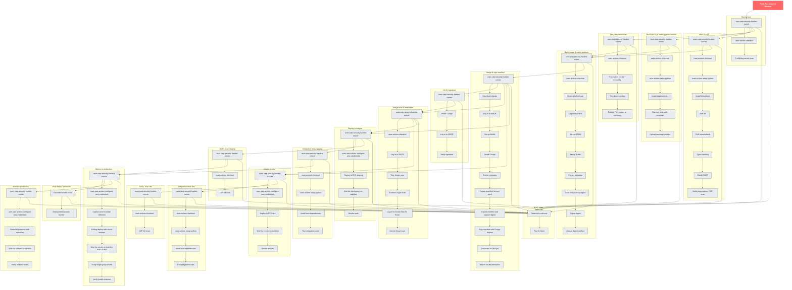

```mermaid
flowchart TD
    trigger["Push Pull_request Release"]:::trigger
    subgraph secret_scan["Secret scan"]
        secret_scan_step_0["uses step-security harden-runner"]:::step
        secret_scan_step_1["uses actions checkout"]:::step
        secret_scan_step_0 --> secret_scan_step_1
        secret_scan_step_2["TruffleHog secret scan"]:::step
        secret_scan_step_1 --> secret_scan_step_2
    end
    subgraph lint["Lint &amp; SAST"]
        lint_step_0["uses step-security harden-runner"]:::step
        lint_step_1["uses actions checkout"]:::step
        lint_step_0 --> lint_step_1
        lint_step_2["uses actions setup-python"]:::step
        lint_step_1 --> lint_step_2
        lint_step_3["Install linting tools"]:::step
        lint_step_2 --> lint_step_3
        lint_step_4["Ruff lint"]:::step
        lint_step_3 --> lint_step_4
        lint_step_5["Ruff format check"]:::step
        lint_step_4 --> lint_step_5
        lint_step_6["Type checking"]:::step
        lint_step_5 --> lint_step_6
        lint_step_7["Bandit SAST"]:::step
        lint_step_6 --> lint_step_7
        lint_step_8["Safety dependency CVE scan"]:::step
        lint_step_7 --> lint_step_8
    end
    subgraph test["Test suite Py $ matrix.python-version"]
        test_step_0["uses step-security harden-runner"]:::step
        test_step_1["uses actions checkout"]:::step
        test_step_0 --> test_step_1
        test_step_2["uses actions setup-python"]:::step
        test_step_1 --> test_step_2
        test_step_3["Install dependencies"]:::step
        test_step_2 --> test_step_3
        test_step_4["Run unit tests with coverage"]:::step
        test_step_3 --> test_step_4
        test_step_5["Upload coverage artefact"]:::step
        test_step_4 --> test_step_5
    end
    subgraph trivy_fs["Trivy filesystem scan"]
        trivy_fs_step_0["uses step-security harden-runner"]:::step
        trivy_fs_step_1["uses actions checkout"]:::step
        trivy_fs_step_0 --> trivy_fs_step_1
        trivy_fs_step_2["Trivy vuln + secret + misconfig"]:::step
        trivy_fs_step_1 --> trivy_fs_step_2
        trivy_fs_step_3["Trivy licence policy"]:::step
        trivy_fs_step_2 --> trivy_fs_step_3
        trivy_fs_step_4["Publish Trivy output to summary"]:::step
        trivy_fs_step_3 --> trivy_fs_step_4
    end
    subgraph build["Build image $ matrix.platform"]
        build_step_0["uses step-security harden-runner"]:::step
        build_step_1["uses actions checkout"]:::step
        build_step_0 --> build_step_1
        build_step_2["Derive platform pair"]:::step
        build_step_1 --> build_step_2
        build_step_3["Log in to GHCR"]:::step
        build_step_2 --> build_step_3
        build_step_4["Set up QEMU"]:::step
        build_step_3 --> build_step_4
        build_step_5["Set up Buildx"]:::step
        build_step_4 --> build_step_5
        build_step_6["Extract metadata"]:::step
        build_step_5 --> build_step_6
        build_step_7["Build and push by digest"]:::step
        build_step_6 --> build_step_7
        build_step_8["Export digest"]:::step
        build_step_7 --> build_step_8
        build_step_9["Upload digest artefact"]:::step
        build_step_8 --> build_step_9
    end
    subgraph merge["Merge &amp; sign manifest"]
        merge_step_0["uses step-security harden-runner"]:::step
        merge_step_1["Download digests"]:::step
        merge_step_0 --> merge_step_1
        merge_step_2["Log in to GHCR"]:::step
        merge_step_1 --> merge_step_2
        merge_step_3["Set up Buildx"]:::step
        merge_step_2 --> merge_step_3
        merge_step_4["Install Cosign"]:::step
        merge_step_3 --> merge_step_4
        merge_step_5["Docker metadata"]:::step
        merge_step_4 --> merge_step_5
        merge_step_6["Create manifest list and push"]:::step
        merge_step_5 --> merge_step_6
        merge_step_7["Inspect manifest and capture digest"]:::step
        merge_step_6 --> merge_step_7
        merge_step_8["Sign manifest with Cosign keyless"]:::step
        merge_step_7 --> merge_step_8
        merge_step_9["Generate SBOM Syft"]:::step
        merge_step_8 --> merge_step_9
        merge_step_10["Attach SBOM attestation"]:::step
        merge_step_9 --> merge_step_10
    end
    subgraph verifysig["Verify signature"]
        verifysig_step_0["uses step-security harden-runner"]:::step
        verifysig_step_1["Install Cosign"]:::step
        verifysig_step_0 --> verifysig_step_1
        verifysig_step_2["Log in to GHCR"]:::step
        verifysig_step_1 --> verifysig_step_2
        verifysig_step_3["Verify signature"]:::step
        verifysig_step_2 --> verifysig_step_3
    end
    subgraph scan["Image scan $ matrix.tool"]
        scan_step_0["uses step-security harden-runner"]:::step
        scan_step_1["uses actions checkout"]:::step
        scan_step_0 --> scan_step_1
        scan_step_2["Log in to GHCR"]:::step
        scan_step_1 --> scan_step_2
        scan_step_3["Trivy image scan"]:::step
        scan_step_2 --> scan_step_3
        scan_step_4["Anchore Grype scan"]:::step
        scan_step_3 --> scan_step_4
        scan_step_5["Log in to Docker Hub for Scout"]:::step
        scan_step_4 --> scan_step_5
        scan_step_6["Docker Scout scan"]:::step
        scan_step_5 --> scan_step_6
    end
    subgraph deploydev["Deploy to dev"]
        deploydev_step_0["uses step-security harden-runner"]:::step
        deploydev_step_1["uses aws-actions configure-aws-credentials"]:::step
        deploydev_step_0 --> deploydev_step_1
        deploydev_step_2["Deploy to ECS dev"]:::step
        deploydev_step_1 --> deploydev_step_2
        deploydev_step_3["Wait for service to stabilise"]:::step
        deploydev_step_2 --> deploydev_step_3
        deploydev_step_4["Smoke test dev"]:::step
        deploydev_step_3 --> deploydev_step_4
    end
    subgraph integrationtestsdev["Integration tests dev"]
        integrationtestsdev_step_0["uses step-security harden-runner"]:::step
        integrationtestsdev_step_1["uses actions checkout"]:::step
        integrationtestsdev_step_0 --> integrationtestsdev_step_1
        integrationtestsdev_step_2["uses actions setup-python"]:::step
        integrationtestsdev_step_1 --> integrationtestsdev_step_2
        integrationtestsdev_step_3["Install test dependencies"]:::step
        integrationtestsdev_step_2 --> integrationtestsdev_step_3
        integrationtestsdev_step_4["Run integration suite"]:::step
        integrationtestsdev_step_3 --> integrationtestsdev_step_4
    end
    subgraph zapscandev["DAST scan dev"]
        zapscandev_step_0["uses step-security harden-runner"]:::step
        zapscandev_step_1["uses actions checkout"]:::step
        zapscandev_step_0 --> zapscandev_step_1
        zapscandev_step_2["ZAP full scan"]:::step
        zapscandev_step_1 --> zapscandev_step_2
    end
    subgraph deploystaging["Deploy to staging"]
        deploystaging_step_0["uses step-security harden-runner"]:::step
        deploystaging_step_1["uses aws-actions configure-aws-credentials"]:::step
        deploystaging_step_0 --> deploystaging_step_1
        deploystaging_step_2["Deploy to ECS staging"]:::step
        deploystaging_step_1 --> deploystaging_step_2
        deploystaging_step_3["Wait for deployment to stabilise"]:::step
        deploystaging_step_2 --> deploystaging_step_3
        deploystaging_step_4["Smoke tests"]:::step
        deploystaging_step_3 --> deploystaging_step_4
    end
    subgraph integrationtests["Integration tests staging"]
        integrationtests_step_0["uses step-security harden-runner"]:::step
        integrationtests_step_1["uses actions checkout"]:::step
        integrationtests_step_0 --> integrationtests_step_1
        integrationtests_step_2["uses actions setup-python"]:::step
        integrationtests_step_1 --> integrationtests_step_2
        integrationtests_step_3["Install test dependencies"]:::step
        integrationtests_step_2 --> integrationtests_step_3
        integrationtests_step_4["Run integration suite"]:::step
        integrationtests_step_3 --> integrationtests_step_4
    end
    subgraph zapscan["DAST scan staging"]
        zapscan_step_0["uses step-security harden-runner"]:::step
        zapscan_step_1["uses actions checkout"]:::step
        zapscan_step_0 --> zapscan_step_1
        zapscan_step_2["ZAP full scan"]:::step
        zapscan_step_1 --> zapscan_step_2
    end
    subgraph deployproduction["Deploy to production"]
        deployproduction_step_0["uses step-security harden-runner"]:::step
        deployproduction_step_1["uses aws-actions configure-aws-credentials"]:::step
        deployproduction_step_0 --> deployproduction_step_1
        deployproduction_step_2["Capture previous task definition"]:::step
        deployproduction_step_1 --> deployproduction_step_2
        deployproduction_step_3["Rolling deploy with circuit breaker"]:::step
        deployproduction_step_2 --> deployproduction_step_3
        deployproduction_step_4["Wait for service to stabilise max 15 min"]:::step
        deployproduction_step_3 --> deployproduction_step_4
        deployproduction_step_5["Verify target group health"]:::step
        deployproduction_step_4 --> deployproduction_step_5
        deployproduction_step_6["Verify health endpoint"]:::step
        deployproduction_step_5 --> deployproduction_step_6
    end
    subgraph postdeploy["Post-deploy validation"]
        postdeploy_step_0["Extended smoke tests"]:::step
        postdeploy_step_1["Deployment success marker"]:::step
        postdeploy_step_0 --> postdeploy_step_1
    end
    subgraph rollbackproduction["Rollback production"]
        rollbackproduction_step_0["uses step-security harden-runner"]:::step
        rollbackproduction_step_1["uses aws-actions configure-aws-credentials"]:::step
        rollbackproduction_step_0 --> rollbackproduction_step_1
        rollbackproduction_step_2["Revert to previous task definition"]:::step
        rollbackproduction_step_1 --> rollbackproduction_step_2
        rollbackproduction_step_3["Wait for rollback to stabilise"]:::step
        rollbackproduction_step_2 --> rollbackproduction_step_3
        rollbackproduction_step_4["Verify rollback health"]:::step
        rollbackproduction_step_3 --> rollbackproduction_step_4
    end
    subgraph notify["Notify team"]
        notify_step_0["Determine outcome"]:::step
        notify_step_1["Post to Slack"]:::step
        notify_step_0 --> notify_step_1
    end
    trigger --> secret_scan_step_0
    secret_scan_step_0 --> lint_step_0
    secret_scan_step_0 --> test_step_0
    secret_scan_step_0 --> trivy_fs_step_0
    lint_step_0 --> build_step_0
    test_step_0 --> build_step_0
    trivy_fs_step_0 --> build_step_0
    build_step_0 --> merge_step_0
    merge_step_0 --> verifysig_step_0
    verifysig_step_0 --> scan_step_0
    merge_step_0 --> scan_step_0
    scan_step_0 --> deploydev_step_0
    merge_step_0 --> deploydev_step_0
    deploydev_step_0 --> integrationtestsdev_step_0
    deploydev_step_0 --> zapscandev_step_0
    scan_step_0 --> deploystaging_step_0
    merge_step_0 --> deploystaging_step_0
    deploystaging_step_0 --> integrationtests_step_0
    deploystaging_step_0 --> zapscan_step_0
    integrationtests_step_0 --> deployproduction_step_0
    zapscan_step_0 --> deployproduction_step_0
    deployproduction_step_0 --> postdeploy_step_0
    deployproduction_step_0 --> rollbackproduction_step_0
    secret_scan_step_0 --> notify_step_0
    lint_step_0 --> notify_step_0
    test_step_0 --> notify_step_0
    trivy_fs_step_0 --> notify_step_0
    build_step_0 --> notify_step_0
    merge_step_0 --> notify_step_0
    verifysig_step_0 --> notify_step_0
    scan_step_0 --> notify_step_0
    deploydev_step_0 --> notify_step_0
    integrationtestsdev_step_0 --> notify_step_0
    zapscandev_step_0 --> notify_step_0
    deploystaging_step_0 --> notify_step_0
    integrationtests_step_0 --> notify_step_0
    zapscan_step_0 --> notify_step_0
    deployproduction_step_0 --> notify_step_0
    postdeploy_step_0 --> notify_step_0
    rollbackproduction_step_0 --> notify_step_0
    trigger --> notify_step_0
    classDef trigger fill:#f66,stroke:#c92a2a,color:#fff,font-weight:bold
    classDef step fill:#e9ecef,stroke:#495057,color:#212529
```