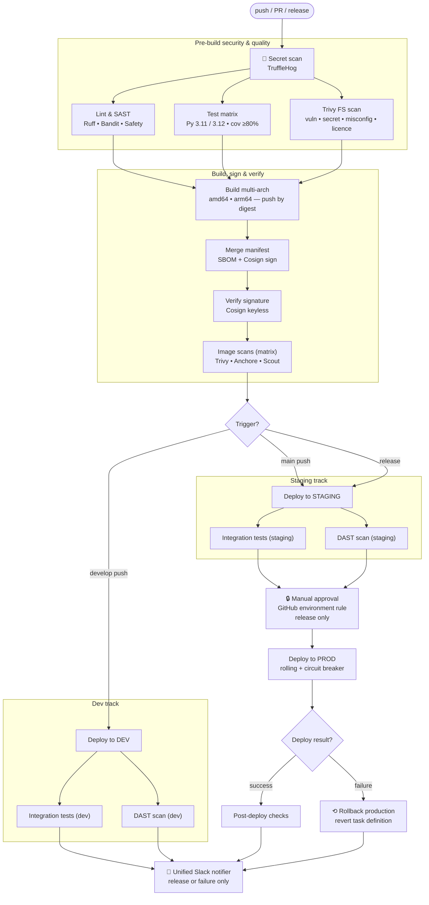

# Part 6: CI/CD Pipeline Review

## Current Pipeline — Problems Identified (7 issues)

### No Approval Gate Before Production Deployment

The pipeline deploys directly to production on every push to `main`. There is no manual approval, no staging validation, and no human checkpoint. A broken commit merges → production goes down.

### No Rollback Mechanism

The deploy step uses `rsync` with no versioning, blue-green, or canary strategy. If the deployment fails mid-transfer, the server is left in a half-deployed, inconsistent state. There is no way to revert to the previous known-good state.

### Tests and Deploy Run in the Same Job

If tests pass, deployment immediately follows in the same job. There is no separation of concerns, no ability to re-run deployment independently, and no way to gate deployment on additional conditions (e.g., security scan results).

### No Security Scanning

No dependency vulnerability scanning (e.g., `pip audit`, `safety`, Dependabot), no SAST (static analysis), no secret scanning, and no container image scanning. Vulnerable dependencies ship to production undetected.

### Direct SSH/rsync to Server (No Infrastructure Abstraction)

The `rsync` deploy pattern implies direct SSH access from the CI runner to the production server. This requires storing SSH keys as secrets, opens a direct network path from GitHub to production, and bypasses any deployment orchestration.

### No Environment Promotion (dev → staging → prod)

There is only one environment. Code goes from a developer's branch directly to production. No staging or QA environment exists for integration testing, performance testing, or stakeholder validation.

### No Build Artefact / Caching

Dependencies are installed from scratch on every run (`pip install -r requirements.txt`). No caching, no artefact storage, no Docker image build. This makes builds slower and non-reproducible (dependency resolution can differ between runs if versions aren't pinned).

---

## Proposed Production-Ready CI/CD Pipeline

### Architecture Overview




### Improved GitHub Actions Workflow

```yaml
# ==============================================================================
# TechKraft CI/CD Pipeline
#
# Requirements coverage:
#   • Security scanning      → secret_scan, lint (SAST+deps), trivy_fs,
#                              image scans, zap_scan (DAST on dev + staging),
#                              cosign signing + verification, SBOM attestation
#   • Testing strategy       → unit tests (matrix + 80% coverage), integration
#                              tests on dev + staging, smoke tests after every
#                              deploy, DAST on dev + staging
#   • Approval gates         → GitHub environment protection rules on
#                              `staging`, `production`, `production-rollback`
#                              (configure required reviewers in repo settings)
#   • Rollback mechanism     → (1) ECS deployment circuit breaker for automatic
#                                  rollback during rolling deploys
#                              (2) Explicit `rollback-production` job triggered
#                                  when `deploy-production` fails, reverting to
#                                  the task definition captured pre-deploy
#   • Environment promotion  → develop → dev → main → staging → release → prod
# ==============================================================================

name: CI/CD Pipeline

on:
  push:
    branches: [main, develop]
  pull_request:
    branches: [main]
  release:
    types: [published]

env:
  REGISTRY: ghcr.io
  IMAGE_NAME: ${{ github.repository }}
  PYTHON_VERSION: "3.11"

# Cancel in-progress runs for the same branch, but NEVER cancel a release
# — production deploys must complete.
concurrency:
  group: ${{ github.workflow }}-${{ github.ref }}
  cancel-in-progress: ${{ github.event_name != 'release' }}

# Default permissions (least privilege). Jobs elevate individually.
permissions:
  contents: read

jobs:
  # ---------------------------------------------------------------------------
  # JOB 0 — Secret scanning (fail fast on leaked credentials)
  # ---------------------------------------------------------------------------
  secret_scan:
    name: Secret scan
    runs-on: ubuntu-latest
    steps:
      - uses: step-security/harden-runner@v2
        with:
          disable-sudo: true
          egress-policy: audit

      - uses: actions/checkout@v4
        with:
          persist-credentials: false
          fetch-depth: 0   # TruffleHog needs full history

      - name: TruffleHog secret scan
        uses: trufflesecurity/trufflehog@main
        with:
          extra_args: --results=verified,unknown

  # ---------------------------------------------------------------------------
  # JOB 1 — Lint, SAST, dependency CVE scan
  # ---------------------------------------------------------------------------
  lint:
    name: Lint & SAST
    runs-on: ubuntu-latest
    needs: [secret_scan]
    steps:
      - uses: step-security/harden-runner@v2
        with:
          disable-sudo: true
          egress-policy: audit

      - uses: actions/checkout@v4
        with:
          persist-credentials: false

      - uses: actions/setup-python@v5
        with:
          python-version: ${{ env.PYTHON_VERSION }}
          cache: pip

      - name: Install linting tools
        run: pip install ruff bandit mypy safety

      - name: Ruff lint
        run: ruff check .

      - name: Ruff format check
        run: ruff format --check .

      - name: Type checking
        run: mypy --ignore-missing-imports .

      - name: Bandit (SAST)
        run: bandit -r . -x ./tests --severity-level medium

      - name: Safety (dependency CVE scan)
        run: safety check -r requirements.txt

  # ---------------------------------------------------------------------------
  # JOB 2 — Unit tests with coverage gate (matrix across Python versions)
  # ---------------------------------------------------------------------------
  test:
    name: Test suite (Py ${{ matrix.python-version }})
    runs-on: ubuntu-latest
    needs: [secret_scan]
    strategy:
      fail-fast: false
      matrix:
        python-version: ["3.11", "3.12"]
    services:
      mysql:
        image: mysql:8.0
        env:
          MYSQL_ROOT_PASSWORD: testpass
          MYSQL_DATABASE: testdb
        ports:
          - 3306:3306
        options: >-
          --health-cmd="mysqladmin ping"
          --health-interval=10s
          --health-timeout=5s
          --health-retries=3
    steps:
      - uses: step-security/harden-runner@v2
        with:
          disable-sudo: true
          egress-policy: audit

      - uses: actions/checkout@v4
        with:
          persist-credentials: false

      - uses: actions/setup-python@v5
        with:
          python-version: ${{ matrix.python-version }}
          cache: pip

      - name: Install dependencies
        run: |
          pip install -r requirements.txt
          pip install pytest pytest-cov pytest-xdist

      - name: Run unit tests with coverage
        run: pytest --cov=. --cov-report=xml --cov-fail-under=80 -n auto

      - name: Upload coverage artefact
        if: always()
        uses: actions/upload-artifact@v4
        with:
          name: coverage-${{ matrix.python-version }}
          path: coverage.xml
          retention-days: 14

  # ---------------------------------------------------------------------------
  # JOB 3 — Trivy filesystem scan (IaC, secrets, misconfig, licences)
  # ---------------------------------------------------------------------------
  trivy_fs:
    name: Trivy filesystem scan
    runs-on: ubuntu-latest
    needs: [secret_scan]
    steps:
      - uses: step-security/harden-runner@v2
        with:
          disable-sudo: true
          egress-policy: audit

      - uses: actions/checkout@v4
        with:
          persist-credentials: false

      - name: Trivy (vuln + secret + misconfig)
        uses: aquasecurity/trivy-action@0.33.0
        with:
          scan-type: fs
          scan-ref: .
          scanners: vuln,secret,misconfig
          severity: CRITICAL,HIGH
          exit-code: "1"
          ignore-unfixed: true
          output: trivy-fs.txt

      - name: Trivy licence policy
        run: |
          curl -sfL https://raw.githubusercontent.com/aquasecurity/trivy/main/contrib/install.sh | sh -s -- -b /usr/local/bin
          trivy fs . --scanners license \
            --license-forbidden "GPL-3.0,AGPL-3.0,SSPL-1.0" \
            --exit-code 1 \
            --ignore-unfixed

      - name: Publish Trivy output to summary
        if: always()
        run: |
          if [[ -s trivy-fs.txt ]]; then
            {
              echo "### Trivy filesystem scan"
              echo "<details><summary>Click to expand</summary>"
              echo ""
              echo '```'
              cat trivy-fs.txt
              echo '```'
              echo "</details>"
            } >> "$GITHUB_STEP_SUMMARY"
          fi

  # ---------------------------------------------------------------------------
  # JOB 4 — Build multi-arch Docker image (push by digest per platform)
  # ---------------------------------------------------------------------------
  build:
    name: Build image (${{ matrix.platform }})
    needs: [lint, test, trivy_fs]
    runs-on: ubuntu-latest
    permissions:
      contents: read
      packages: write
      id-token: write
    strategy:
      fail-fast: false
      matrix:
        platform: [linux/amd64, linux/arm64]
    steps:
      - uses: step-security/harden-runner@v2
        with:
          disable-sudo: true
          egress-policy: audit

      - uses: actions/checkout@v4
        with:
          persist-credentials: false

      - name: Derive platform pair
        run: echo "PLATFORM_PAIR=${{ matrix.platform }}" | tr '/' '-' >> "$GITHUB_ENV"

      - name: Log in to GHCR
        uses: docker/login-action@v3
        with:
          registry: ${{ env.REGISTRY }}
          username: ${{ github.actor }}
          password: ${{ secrets.GITHUB_TOKEN }}

      - name: Set up QEMU
        uses: docker/setup-qemu-action@v3

      - name: Set up Buildx
        uses: docker/setup-buildx-action@v3

      - name: Extract metadata
        id: meta
        uses: docker/metadata-action@v5
        with:
          images: ${{ env.REGISTRY }}/${{ env.IMAGE_NAME }}

      - name: Build and push by digest
        id: build_push
        uses: docker/build-push-action@v6
        with:
          context: .
          platforms: ${{ matrix.platform }}
          labels: ${{ steps.meta.outputs.labels }}
          cache-from: type=gha,scope=${{ env.PLATFORM_PAIR }}
          cache-to: type=gha,mode=max,scope=${{ env.PLATFORM_PAIR }}
          outputs: type=image,name=${{ env.REGISTRY }}/${{ env.IMAGE_NAME }},push-by-digest=true,name-canonical=true,push=true

      - name: Export digest
        run: |
          mkdir -p "${{ runner.temp }}/digests"
          digest="${{ steps.build_push.outputs.digest }}"
          touch "${{ runner.temp }}/digests/${digest#sha256:}"

      - name: Upload digest artefact
        uses: actions/upload-artifact@v4
        with:
          name: digests-${{ env.PLATFORM_PAIR }}
          path: ${{ runner.temp }}/digests/*
          if-no-files-found: error
          retention-days: 1

  # ---------------------------------------------------------------------------
  # JOB 5 — Merge per-arch digests into a multi-arch manifest, sign, SBOM
  # ---------------------------------------------------------------------------
  merge:
    name: Merge & sign manifest
    runs-on: ubuntu-latest
    needs: [build]
    permissions:
      contents: read
      packages: write
      id-token: write
    outputs:
      digest: ${{ steps.inspect.outputs.digest }}
      tags: ${{ steps.meta.outputs.tags }}
    steps:
      - uses: step-security/harden-runner@v2
        with:
          disable-sudo: true
          egress-policy: audit

      - name: Download digests
        uses: actions/download-artifact@v4
        with:
          path: ${{ runner.temp }}/digests
          pattern: digests-*
          merge-multiple: true

      - name: Log in to GHCR
        uses: docker/login-action@v3
        with:
          registry: ${{ env.REGISTRY }}
          username: ${{ github.actor }}
          password: ${{ secrets.GITHUB_TOKEN }}

      - name: Set up Buildx
        uses: docker/setup-buildx-action@v3

      - name: Install Cosign
        uses: sigstore/cosign-installer@v3

      - name: Docker metadata
        id: meta
        uses: docker/metadata-action@v5
        with:
          images: ${{ env.REGISTRY }}/${{ env.IMAGE_NAME }}
          tags: |
            type=sha,prefix=
            type=ref,event=branch
            type=semver,pattern={{version}}
            type=semver,pattern={{major}}.{{minor}}

      - name: Create manifest list and push
        working-directory: ${{ runner.temp }}/digests
        run: |
          docker buildx imagetools create \
            $(jq -cr '.tags | map("-t " + .) | join(" ")' <<< "$DOCKER_METADATA_OUTPUT_JSON") \
            $(printf '${{ env.REGISTRY }}/${{ env.IMAGE_NAME }}@sha256:%s ' *)

      - name: Inspect manifest and capture digest
        id: inspect
        run: |
          TAG=$(echo '${{ steps.meta.outputs.tags }}' | head -n1)
          DIGEST=$(docker buildx imagetools inspect "$TAG" --format '{{json .Manifest}}' | jq -r '.digest')
          echo "digest=$DIGEST" >> "$GITHUB_OUTPUT"

      - name: Sign manifest with Cosign (keyless)
        env:
          DIGEST: ${{ steps.inspect.outputs.digest }}
        run: cosign sign --yes "${{ env.REGISTRY }}/${{ env.IMAGE_NAME }}@${DIGEST}"

      - name: Generate SBOM (Syft)
        uses: anchore/sbom-action@v0
        with:
          image: ${{ env.REGISTRY }}/${{ env.IMAGE_NAME }}@${{ steps.inspect.outputs.digest }}
          format: spdx-json
          output-file: sbom.spdx.json
          upload-artifact: true

      - name: Attach SBOM attestation
        run: |
          cosign attest --yes \
            --predicate sbom.spdx.json \
            --type spdxjson \
            "${{ env.REGISTRY }}/${{ env.IMAGE_NAME }}@${{ steps.inspect.outputs.digest }}"

  # ---------------------------------------------------------------------------
  # JOB 6 — Verify image signature before any deployment
  # ---------------------------------------------------------------------------
  verify-sig:
    name: Verify signature
    runs-on: ubuntu-latest
    needs: [merge]
    permissions:
      contents: read
      packages: read
      id-token: write
    steps:
      - uses: step-security/harden-runner@v2
        with:
          disable-sudo: true
          egress-policy: audit

      - name: Install Cosign
        uses: sigstore/cosign-installer@v3

      - name: Log in to GHCR
        uses: docker/login-action@v3
        with:
          registry: ${{ env.REGISTRY }}
          username: ${{ github.actor }}
          password: ${{ secrets.GITHUB_TOKEN }}

      - name: Verify signature
        env:
          IMAGE: ${{ env.REGISTRY }}/${{ env.IMAGE_NAME }}@${{ needs.merge.outputs.digest }}
          IDENTITY_REGEX: "^https://github.com/${{ github.repository }}/.github/workflows/.+@refs/(heads|tags)/.+"
          OIDC_ISSUER: "https://token.actions.githubusercontent.com"
        run: |
          cosign verify \
            --certificate-identity-regexp "$IDENTITY_REGEX" \
            --certificate-oidc-issuer "$OIDC_ISSUER" \
            "$IMAGE"

  # ---------------------------------------------------------------------------
  # JOB 7 — Container image vulnerability scans (parallel scanners)
  # ---------------------------------------------------------------------------
  scan:
    name: Image scan (${{ matrix.tool }})
    runs-on: ubuntu-latest
    needs: [verify-sig, merge]
    permissions:
      contents: read
      packages: read
      security-events: write
    strategy:
      fail-fast: false
      matrix:
        tool: [trivy, anchore, scout]
    steps:
      - uses: step-security/harden-runner@v2
        with:
          disable-sudo: true
          egress-policy: audit

      - uses: actions/checkout@v4
        with:
          persist-credentials: false

      - name: Log in to GHCR
        uses: docker/login-action@v3
        with:
          registry: ${{ env.REGISTRY }}
          username: ${{ github.actor }}
          password: ${{ secrets.GITHUB_TOKEN }}

      - name: Trivy image scan
        if: matrix.tool == 'trivy'
        uses: aquasecurity/trivy-action@0.33.0
        with:
          image-ref: ${{ env.REGISTRY }}/${{ env.IMAGE_NAME }}@${{ needs.merge.outputs.digest }}
          format: table
          ignore-unfixed: true
          scanners: vuln,secret,misconfig
          severity: CRITICAL,HIGH
          exit-code: "1"

      - name: Anchore Grype scan
        if: matrix.tool == 'anchore'
        uses: anchore/scan-action@v6
        with:
          image: ${{ env.REGISTRY }}/${{ env.IMAGE_NAME }}@${{ needs.merge.outputs.digest }}
          severity-cutoff: high
          fail-build: true

      - name: Log in to Docker Hub (for Scout)
        if: matrix.tool == 'scout'
        uses: docker/login-action@v3
        with:
          username: ${{ secrets.DOCKER_USER }}
          password: ${{ secrets.DOCKER_PAT }}

      - name: Docker Scout scan
        if: matrix.tool == 'scout'
        uses: docker/scout-action@v1
        with:
          command: quickview,cves,recommendations
          image: ${{ env.REGISTRY }}/${{ env.IMAGE_NAME }}@${{ needs.merge.outputs.digest }}
          ignore-unchanged: true
          only-severities: critical,high
          exit-code: true
          write-comment: ${{ github.event_name == 'pull_request' }}
          github-token: ${{ secrets.GITHUB_TOKEN }}

  # ===========================================================================
  # DEV TRACK — runs on `develop` branch only, parallel to staging track
  # ===========================================================================

  # ---------------------------------------------------------------------------
  # JOB 8 — Deploy to DEV (develop branch)
  # ---------------------------------------------------------------------------
  deploy-dev:
    name: Deploy to dev
    needs: [scan, merge]
    runs-on: ubuntu-latest
    if: github.ref == 'refs/heads/develop' && github.event_name == 'push'
    permissions:
      contents: read
      id-token: write
    environment:
      name: dev
      url: https://dev.techkraft.com
    steps:
      - uses: step-security/harden-runner@v2
        with:
          disable-sudo: true
          egress-policy: audit

      - uses: aws-actions/configure-aws-credentials@v4
        with:
          role-to-assume: ${{ secrets.AWS_DEPLOY_ROLE_DEV }}
          aws-region: us-east-1

      - name: Deploy to ECS (dev)
        run: |
          aws ecs update-service \
            --cluster techkraft-dev \
            --service backend \
            --force-new-deployment \
            --deployment-configuration "deploymentCircuitBreaker={enable=true,rollback=true},maximumPercent=200,minimumHealthyPercent=100"

      - name: Wait for service to stabilise
        run: aws ecs wait services-stable --cluster techkraft-dev --services backend

      - name: Smoke test dev
        run: |
          for i in {1..5}; do
            STATUS=$(curl -sf -o /dev/null -w "%{http_code}" https://dev.techkraft.com/health || echo "000")
            if [ "$STATUS" = "200" ]; then echo "OK"; exit 0; fi
            echo "Attempt $i: $STATUS — retrying in 10s"
            sleep 10
          done
          exit 1

  # ---------------------------------------------------------------------------
  # JOB 9 — Integration tests against dev
  # ---------------------------------------------------------------------------
  integration-tests-dev:
    name: Integration tests (dev)
    needs: [deploy-dev]
    runs-on: ubuntu-latest
    steps:
      - uses: step-security/harden-runner@v2
        with:
          disable-sudo: true
          egress-policy: audit

      - uses: actions/checkout@v4
        with:
          persist-credentials: false

      - uses: actions/setup-python@v5
        with:
          python-version: ${{ env.PYTHON_VERSION }}
          cache: pip

      - name: Install test dependencies
        run: pip install -r requirements-test.txt

      - name: Run integration suite
        run: pytest tests/integration/ --base-url=https://dev.techkraft.com -v

  # ---------------------------------------------------------------------------
  # JOB 10 — DAST scan against dev (ZAP)
  # ---------------------------------------------------------------------------
  zap-scan-dev:
    name: DAST scan (dev)
    needs: [deploy-dev]
    runs-on: ubuntu-latest
    permissions:
      contents: read
      issues: write
    steps:
      - uses: step-security/harden-runner@v2
        with:
          disable-sudo: true
          egress-policy: audit

      - uses: actions/checkout@v4
        with:
          persist-credentials: false

      - name: ZAP full scan
        uses: zaproxy/action-full-scan@v0.12.0
        with:
          token: ${{ secrets.GITHUB_TOKEN }}
          docker_name: "ghcr.io/zaproxy/zaproxy:stable"
          target: https://dev.techkraft.com
          rules_file_name: ".zap/rules.tsv"
          cmd_options: "-a"

  # ===========================================================================
  # STAGING + PRODUCTION TRACK — runs on `main` push or release
  # ===========================================================================

  # ---------------------------------------------------------------------------
  # JOB 11 — Deploy to STAGING (main branch + release)
  # ---------------------------------------------------------------------------
  deploy-staging:
    name: Deploy to staging
    needs: [scan, merge]
    runs-on: ubuntu-latest
    if: (github.ref == 'refs/heads/main' && github.event_name == 'push') || github.event_name == 'release'
    permissions:
      contents: read
      id-token: write
    environment:
      name: staging
      url: https://staging.techkraft.com
    steps:
      - uses: step-security/harden-runner@v2
        with:
          disable-sudo: true
          egress-policy: audit

      - uses: aws-actions/configure-aws-credentials@v4
        with:
          role-to-assume: ${{ secrets.AWS_DEPLOY_ROLE_STAGING }}
          aws-region: us-east-1

      - name: Deploy to ECS (staging)
        run: |
          aws ecs update-service \
            --cluster techkraft-staging \
            --service backend \
            --force-new-deployment \
            --desired-count 2 \
            --deployment-configuration "deploymentCircuitBreaker={enable=true,rollback=true}"

      - name: Wait for deployment to stabilise
        run: aws ecs wait services-stable --cluster techkraft-staging --services backend

      - name: Smoke tests
        run: |
          for i in {1..5}; do
            STATUS=$(curl -sf -o /dev/null -w "%{http_code}" https://staging.techkraft.com/health || echo "000")
            if [ "$STATUS" = "200" ]; then echo "Smoke test passed"; exit 0; fi
            echo "Attempt $i: got $STATUS — retrying in 10s"
            sleep 10
          done
          exit 1

  # ---------------------------------------------------------------------------
  # JOB 12 — Integration tests against staging
  # ---------------------------------------------------------------------------
  integration-tests:
    name: Integration tests (staging)
    needs: [deploy-staging]
    runs-on: ubuntu-latest
    steps:
      - uses: step-security/harden-runner@v2
        with:
          disable-sudo: true
          egress-policy: audit

      - uses: actions/checkout@v4
        with:
          persist-credentials: false

      - uses: actions/setup-python@v5
        with:
          python-version: ${{ env.PYTHON_VERSION }}
          cache: pip

      - name: Install test dependencies
        run: pip install -r requirements-test.txt

      - name: Run integration suite
        run: pytest tests/integration/ --base-url=https://staging.techkraft.com -v

  # ---------------------------------------------------------------------------
  # JOB 13 — DAST scan against staging (ZAP)
  # ---------------------------------------------------------------------------
  zap-scan:
    name: DAST scan (staging)
    needs: [deploy-staging]
    runs-on: ubuntu-latest
    permissions:
      contents: read
      issues: write
    steps:
      - uses: step-security/harden-runner@v2
        with:
          disable-sudo: true
          egress-policy: audit

      - uses: actions/checkout@v4
        with:
          persist-credentials: false

      - name: ZAP full scan
        uses: zaproxy/action-full-scan@v0.12.0
        with:
          token: ${{ secrets.GITHUB_TOKEN }}
          docker_name: "ghcr.io/zaproxy/zaproxy:stable"
          target: https://staging.techkraft.com
          rules_file_name: ".zap/rules.tsv"
          cmd_options: "-a"

  # ---------------------------------------------------------------------------
  # JOB 14 — Deploy to PRODUCTION (release only, manual approval)
  # ---------------------------------------------------------------------------
  # The `environment: production` reference enforces approval rules configured
  # in repo Settings → Environments → production (required reviewers, wait
  # timers, branch restrictions).
  # ---------------------------------------------------------------------------
  deploy-production:
    name: Deploy to production
    needs: [integration-tests, zap-scan]
    runs-on: ubuntu-latest
    if: github.event_name == 'release'
    permissions:
      contents: read
      id-token: write
    environment:
      name: production
      url: https://api.techkraft.com
    outputs:
      previous_taskdef: ${{ steps.prev.outputs.taskdef }}
    steps:
      - uses: step-security/harden-runner@v2
        with:
          disable-sudo: true
          egress-policy: audit

      - uses: aws-actions/configure-aws-credentials@v4
        with:
          role-to-assume: ${{ secrets.AWS_DEPLOY_ROLE_PROD }}
          aws-region: us-east-1

      # Capture the current task definition BEFORE deploying — needed by the
      # rollback job if deploy-production fails.
      - name: Capture previous task definition
        id: prev
        run: |
          PREV=$(aws ecs describe-services \
            --cluster techkraft-prod --services backend \
            --query 'services[0].taskDefinition' --output text)
          echo "taskdef=$PREV" >> "$GITHUB_OUTPUT"

      # NOTE: Real canary traffic-shifting requires AWS CodeDeploy Blue/Green
      # or App Mesh. This step uses ECS rolling deployment with the circuit
      # breaker — which auto-rolls-back on failed health checks. For true
      # weighted canary, swap this for a CodeDeploy appspec.yml.
      - name: Rolling deploy with circuit breaker
        run: |
          aws ecs update-service \
            --cluster techkraft-prod \
            --service backend \
            --force-new-deployment \
            --deployment-configuration "deploymentCircuitBreaker={enable=true,rollback=true},maximumPercent=200,minimumHealthyPercent=100"

      - name: Wait for service to stabilise (max 15 min)
        run: |
          timeout 900 aws ecs wait services-stable \
            --cluster techkraft-prod --services backend

      - name: Verify target group health
        run: |
          HEALTHY=$(aws elbv2 describe-target-health \
            --target-group-arn "${{ secrets.PROD_TG_ARN }}" \
            --query 'TargetHealthDescriptions[?TargetHealth.State==`healthy`] | length(@)' \
            --output text)
          if [ "$HEALTHY" -lt 2 ]; then
            echo "FAIL: fewer than 2 healthy targets ($HEALTHY)"
            exit 1
          fi

      - name: Verify /health endpoint
        run: |
          STATUS=$(curl -sf -o /dev/null -w "%{http_code}" https://api.techkraft.com/health)
          [ "$STATUS" = "200" ] || { echo "FAIL: /health returned $STATUS"; exit 1; }

  # ---------------------------------------------------------------------------
  # JOB 15 — Post-deploy validation
  # ---------------------------------------------------------------------------
  post-deploy:
    name: Post-deploy validation
    needs: [deploy-production]
    runs-on: ubuntu-latest
    if: success()
    steps:
      - name: Extended smoke tests
        run: |
          curl -sf https://api.techkraft.com/health | jq .
          curl -sf https://api.techkraft.com/ | jq .

      - name: Deployment success marker
        run: echo "Deployment ${{ github.sha }} verified at $(date -u)"

  # ---------------------------------------------------------------------------
  # JOB 16 — Explicit rollback if production deploy fails
  # ---------------------------------------------------------------------------
  # Safety net on top of the ECS circuit breaker. Triggers only when
  # deploy-production itself fails, reverts to the task definition that was
  # active before the deploy started.
  # ---------------------------------------------------------------------------
  rollback-production:
    name: Rollback production
    needs: [deploy-production]
    runs-on: ubuntu-latest
    if: failure() && needs.deploy-production.result == 'failure'
    permissions:
      contents: read
      id-token: write
    environment:
      name: production-rollback
      url: https://api.techkraft.com
    steps:
      - uses: step-security/harden-runner@v2
        with:
          disable-sudo: true
          egress-policy: audit

      - uses: aws-actions/configure-aws-credentials@v4
        with:
          role-to-assume: ${{ secrets.AWS_DEPLOY_ROLE_PROD }}
          aws-region: us-east-1

      - name: Revert to previous task definition
        env:
          PREV: ${{ needs.deploy-production.outputs.previous_taskdef }}
        run: |
          if [ -z "$PREV" ] || [ "$PREV" = "None" ]; then
            echo "No previous task definition captured — cannot auto-rollback"
            exit 1
          fi
          echo "Rolling back to: $PREV"
          aws ecs update-service \
            --cluster techkraft-prod \
            --service backend \
            --task-definition "$PREV" \
            --force-new-deployment

      - name: Wait for rollback to stabilise
        run: aws ecs wait services-stable --cluster techkraft-prod --services backend

      - name: Verify rollback health
        run: |
          STATUS=$(curl -sf -o /dev/null -w "%{http_code}" https://api.techkraft.com/health)
          if [ "$STATUS" != "200" ]; then
            echo "CRITICAL: rollback completed but /health still failing ($STATUS)"
            exit 1
          fi

  # ---------------------------------------------------------------------------
  # JOB 17 — Unified notifier (replaces dead per-job echo steps)
  # ---------------------------------------------------------------------------
  # Fires a single Slack message at the end with outcome + workflow-run link.
  # Only posts on release events OR any job failure — routine PR/develop
  # runs that pass don't spam the channel.
  # ---------------------------------------------------------------------------
  notify:
    name: Notify team
    runs-on: ubuntu-latest
    needs:
      - secret_scan
      - lint
      - test
      - trivy_fs
      - build
      - merge
      - verify-sig
      - scan
      - deploy-dev
      - integration-tests-dev
      - zap-scan-dev
      - deploy-staging
      - integration-tests
      - zap-scan
      - deploy-production
      - post-deploy
      - rollback-production
    if: always() && (github.event_name == 'release' || contains(needs.*.result, 'failure'))
    steps:
      - name: Determine outcome
        id: outcome
        env:
          NEEDS_JSON: ${{ toJSON(needs) }}
          EVENT: ${{ github.event_name }}
          RB_RESULT: ${{ needs.rollback-production.result }}
          POST_RESULT: ${{ needs.post-deploy.result }}
        run: |
          FAILED=$(echo "$NEEDS_JSON" | jq -r 'to_entries | map(select(.value.result == "failure")) | map("• " + .key) | join("\n")')

          if [[ "$RB_RESULT" == "success" ]]; then
            EMOJI="⚠️"
            TITLE="Production deploy FAILED — rollback succeeded"
          elif [[ "$RB_RESULT" == "failure" ]]; then
            EMOJI="🚨"
            TITLE="Production deploy FAILED and rollback ALSO FAILED — page on-call"
          elif [[ "$EVENT" == "release" && "$POST_RESULT" == "success" ]]; then
            EMOJI="✅"
            TITLE="Production deploy succeeded"
          elif [[ -n "$FAILED" ]]; then
            EMOJI="❌"
            TITLE="Pipeline failed on ${GITHUB_REF_NAME}"
          else
            EMOJI="ℹ️"
            TITLE="Pipeline completed"
          fi

          {
            echo "emoji=$EMOJI"
            echo "title=$TITLE"
            echo "failed<<EOF"
            echo "$FAILED"
            echo "EOF"
          } >> "$GITHUB_OUTPUT"

      - name: Post to Slack
        uses: slackapi/slack-github-action@v1.27.0
        with:
          payload: |
            {
              "text": "${{ steps.outcome.outputs.emoji }} ${{ steps.outcome.outputs.title }}\n*Ref:* `${{ github.ref_name }}` (${{ github.event_name }})\n*Commit:* `${{ github.sha }}`\n${{ steps.outcome.outputs.failed && format('*Failed jobs:*\n{0}\n', steps.outcome.outputs.failed) || '' }}<${{ github.server_url }}/${{ github.repository }}/actions/runs/${{ github.run_id }}|View workflow run →>"
            }
        env:
          SLACK_WEBHOOK_URL: ${{ secrets.SLACK_WEBHOOK }}
          SLACK_WEBHOOK_TYPE: INCOMING_WEBHOOK
```

---

## Key Improvements Summary


| Problem                    | Solution                                                                                                 |
| -------------------------- | -------------------------------------------------------------------------------------------------------- |
| No approval gate           | `environment: production` with required reviewers configured in GitHub repo settings                     |
| No rollback                | ECS deployment circuit breaker with `rollback=true`; canary pattern catches failures before full rollout |
| Tests + deploy in same job | Separated into 7 distinct jobs with explicit dependency chain (`needs:`)                                 |
| No security scanning       | Bandit (SAST), Safety (dependency CVEs), Trivy (container image CVEs), Ruff (linting)                    |
| Direct rsync to server     | Containerised deployment via ECS; IAM roles via OIDC — no SSH keys stored                                |
| No environments            | Three environments: dev (feature branches), staging (main), production (release tags)                    |
| No caching                 | Docker layer caching via GitHub Actions cache; pip caching; concurrency groups                           |
| No notifications           | Slack notification on every production deploy (success or failure)                                       |


---

## Rollback Strategy

1. **Automatic (ECS circuit breaker):** If the new task definition fails health checks, ECS automatically rolls back to the previous task definition. No human intervention needed.
2. **Manual:** Re-run the previous successful release pipeline, which deploys the last known-good Docker image (images are tagged by git SHA and semantic version, never `latest`).
3. **Emergency:** `aws ecs update-service --force-new-deployment --task-definition <previous-version>` — takes effect in ~60 seconds.
